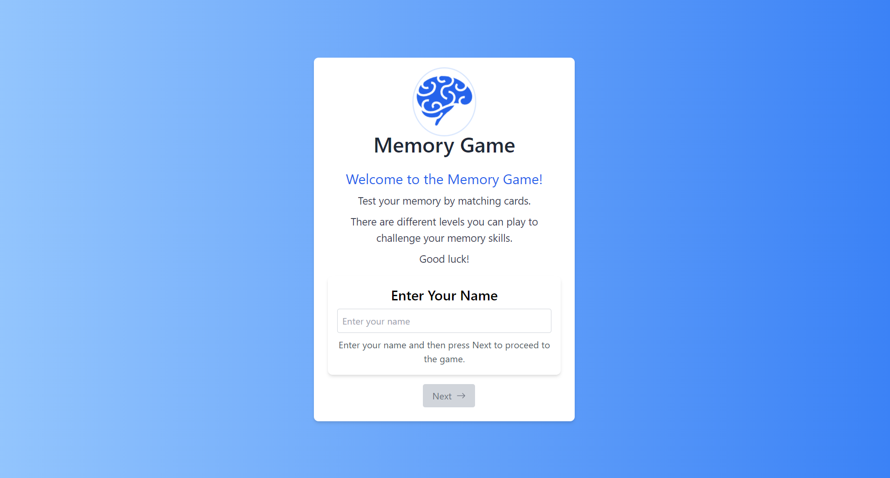
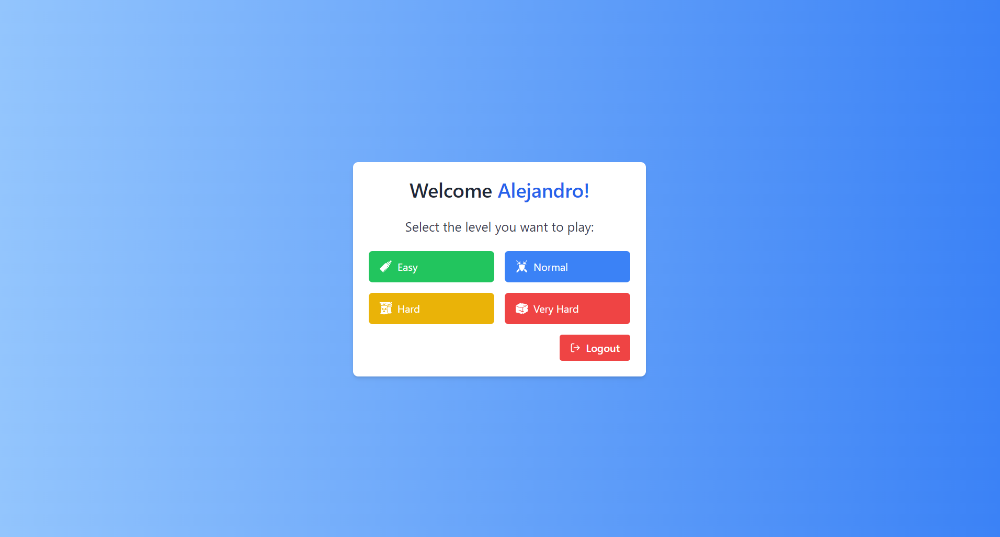
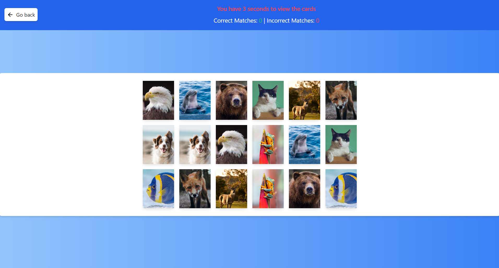
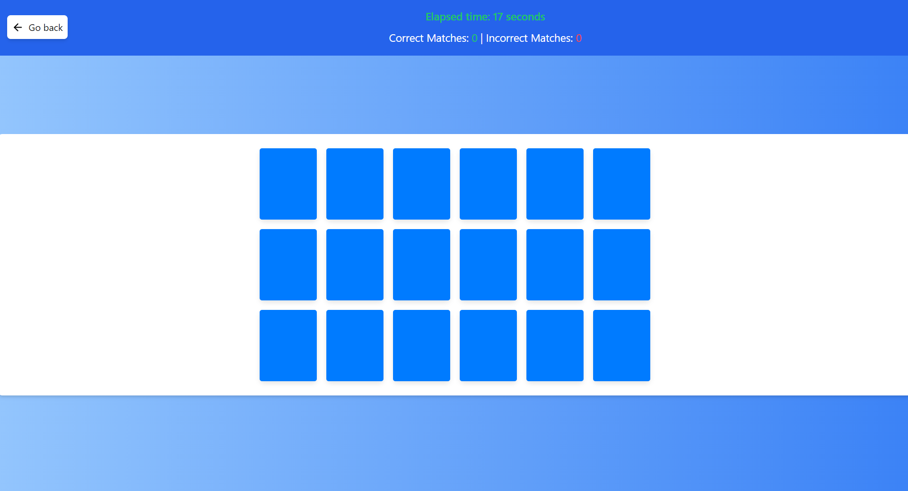
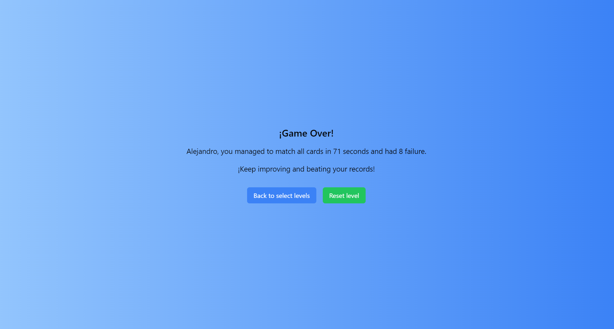

# Memory Card Game

Memory Card Game es una aplicación de juego de memoria desarrollada en React donde los jugadores deben hacer coincidir pares de cartas con imágenes de animales en un tablero. El juego tiene diferentes niveles de dificultad y un temporizador para aumentar el desafío.
---
Memory Card Game is a React-based memory game application where players need to match pairs of cards with animal images on a game board. The game features different levels of difficulty and a timer to increase the challenge.
---

## Características | Features

- Varios niveles de dificultad: 9, 12, 15 y 18 cartas.
- Temporizador para medir el tiempo total de juego.
- Contador de coincidencias correctas e incorrectas.
- Pantalla de Game Over con estadísticas y opciones para reiniciar el nivel o volver a seleccionar el nivel.
---
- Multiple levels of difficulty: 9, 12, 15, and 18 cards.
- Timer to measure the total gameplay time.
- Counter for correct and incorrect matches.
- Game Over screen with statistics and options to reset the level or go back to level selection.

## Tecnologías utilizadas | Technologies Used

- React
- Redux para el manejo del estado
- React Router para la navegación
- TailwindCSS para el diseño y estilos
- Servicio REST para obtener imágenes de animales
---
- React
- Redux for state management
- React Router for navigation
- TailwindCSS for design and styling
- REST service for fetching animal images

## Capturas de pantalla | Screenshots

## Instalación | Installation

1. Clona el repositorio: `git clone https://github.com/alejandroachinelli/react-memory-game.git`
2. Instala las dependencias: `npm install`
3. Inicia la aplicación: `npm start`
---
1. Clone the repository: `git clone https://github.com/alejandroachinelli/react-memory-game.git`
2. Install dependencies: `npm install`
3. Start the application: `npm start`

## Uso | Usage

- Ingresa tu nombre de usuario y luego has click en Next para avanzar
- Selecciona el nivel de dificultad.
- El Juego de Memoria ofrece cuatro niveles de dificultad, cada uno con una cantidad diferente de cartas para emparejar:
1. **Fácil**:
   - Número de Cartas: 9
   - Descripción: Una opción perfecta para principiantes para familiarizarse con las mecánicas del juego.

2. **Medio**:
   - Número de Cartas: 12
   - Descripción: Un desafío moderado que requiere un poco más de memoria y enfoque.

3. **Difícil**:
   - Número de Cartas: 15
   - Descripción: Adecuado para jugadores experimentados que desean un mayor desafío y más cartas para emparejar.

4. **Experto**:
   - Número de Cartas: 18
   - Descripción: Para los verdaderos maestros de la memoria que pueden manejar una gran cantidad de cartas y un alto nivel de dificultad.
- Haz clic en las cartas para encontrar pares coincidentes.
- El temporizador comenzará cuando se revelen las cartas por primera vez.
- Intenta hacer coincidir todas las cartas antes de que se agote el tiempo.
---
- Enter your user name and then click Next to proceed
- Select the difficulty level.
The Memory Game offers four levels of difficulty, each with a different number of cards to match:

1. **Easy**:
   - Number of Cards: 9
   - Description: A perfect choice for beginners to get familiar with the game mechanics.

2. **Normal**:
   - Number of Cards: 12
   - Description: A moderate challenge that requires a bit more memory and focus.

3. **Hard**:
   - Number of Cards: 15
   - Description: Suitable for experienced players who want a greater challenge and more cards to match.

4. **Very Hard**:
   - Number of Cards: 18
   - Description: For the true memory masters who can handle a large number of cards and a high level of difficulty.
- Click on cards to find matching pairs.
- The timer will start when the cards are first revealed.
- Try to match all cards before the time runs out.

## Contribución | Contribution

¡Todas las contribuciones, recomendaciones y consejos son bienvenidos para mejorar este proyecto! Si tienes alguna idea para agregar nuevas características, mejorar la usabilidad o solucionar problemas, no dudes en colaborar. Aquí hay algunas formas en las que puedes contribuir:

- **Reportar problemas**: Si encuentras algún problema o error en el juego, por favor, abre un problema en el repositorio. Proporciona detalles claros y concisos para que podamos entender y abordar el problema.

- **Sugerir mejoras**: Si tienes ideas para mejorar la experiencia de juego, la interfaz de usuario, la accesibilidad o cualquier otra cosa, no dudes en compartir tus sugerencias.

Puedes ponerte en contacto conmigo por correo electrónico en [alejandromartin.achinelli@gmail.com](mailto:alejandromartin.achinelli@gmail.com) o a través de mi perfil de LinkedIn [Linkedin](https://www.linkedin.com/in/alejandroachinelli/) si tienes alguna pregunta, sugerencia o simplemente quieres conversar sobre el proyecto.

Tus consejos o recomendaciones me ayudan a mejorar y crecer como desarrollador y podria hacer que este juego sea aún mejor para todos los jugadores. ¡Muchas gracias!
---
All contributions, recommendations, and advice are welcome to enhance this project! If you have any ideas for adding new features, improving usability, or solving issues, feel free to collaborate. Here are some ways you can contribute:

- **Report Issues**: If you come across any problems or errors in the game, please open an issue in the repository. Provide clear and concise details so that we can understand and address the problem.

- **Propose Enhancements**: If you have ideas to enhance the gaming experience, user interface, accessibility, or anything else, don't hesitate to share your suggestions.

You can get in touch with me via email at [alejandromartin.achinelli@gmail.com](mailto:alejandromartin.achinelli@gmail.com) or through my LinkedIn profile [Linkedin](https://www.linkedin.com/in/alejandroachinelli/) if you have any questions, suggestions, or simply want to discuss the project.

Your tips or recommendations help me improve and grow as a developer, which could make this game even better for all players. Thank you very much!
---
